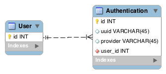

#### Cách thiết kết database về authentication

##### Bài toán

Một **user** có thể register bằng nhiều tài khoản khác nhau như là email, facebook, google, ...

Làm cách nào để có thể thiết kế dữ liệu bài toán trên.

##### Hướng giải

###### Cách 1:

Mình sẽ thiết kế 1 bảng gọi là Authentication có các thuộc tính sau:

- uuid: để lưu id của facebook, google, còn nếu là email thì uuid chính là email
- provider: để biết tài khoản đó là của loại nào như: email, facebook, google, twitter

Đồ thị dạng như sau:

