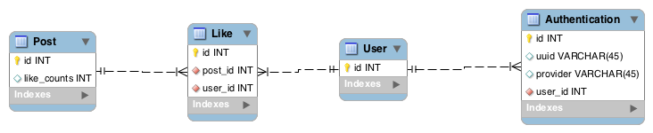

### Cách thiết kế về đếm (count) tổng số lượng

#### Bài toán

Một bài **post** có nhiều **like** của **user**. Làm cách nào để đếm số **like** của bài post đó.

#### Hướng giải quyết

##### Cách 1:

Thường thì chúng ta sẽ truy vấn (query) và đếm (count) luôn cả  bài **like** ở trong. 

Cách này thường query sẽ nặng lên. Và thường thì số lượng query nhiều hơn số lượng insert và update.

Chẳng hạn:

Số lượng vào trang chủ nhiều —> Query nhiều —> Count nhiều hơn.

Cho nên thường sẽ nặng hơn.

Và mình thường sẽ hướng đến cách 2 như sau:

##### Cách 2:

Ở bảng **post** mình sẽ thêm 1 cột là: **like_counts**

Mỗi lần có like thì mình sẽ tăng cột này lên, hoặc dislike sẽ giảm cột này xuống.
Theo mình thì lượng **update** và **insert** thường ít hơn lượng **select** nên thường hay chọn cách này.

