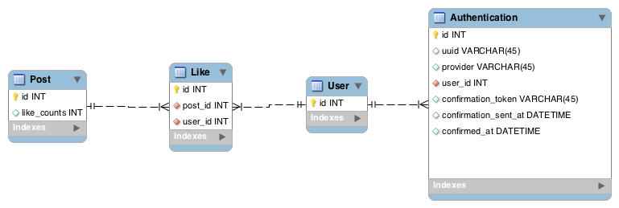

### Cách thiết kế về confirmation

#### Bài toán

Khi đăng ký tài khoản thì cần gửi email xác nhận tài khoản, nếu sau một khoảng thời gian mà không ấn confirm thì coi như hết hạn token đó. Phải gửi lại email.

#### Hướng giải quyết

##### Cách 1:

Mình sẽ thêm 3 cột với các chức năng như sau:

- confirmation_token: Chứa token confirm
- confirmation_sent_at: Chứa ngày tháng gửi token qua email
- confirmed_at: Chứa ngày tháng confirm

Nếu **user** chưa ấn confirm thì cột: **confirmed_at** sẽ là NULL

Như thế, chúng ta vừa biết được token lúc nào hết hạn, và người dùng confirm lúc nào.

